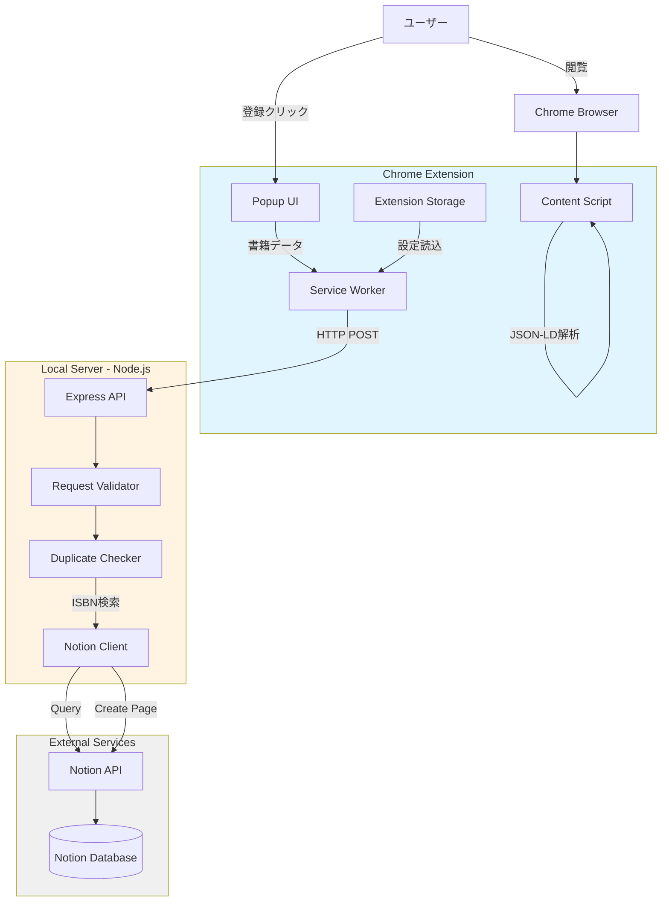

# Design Document: techbook-ledger

## Overview

techbook-ledgerは、技術書の購買意思決定を支援する3層アーキテクチャのシステムです。Chrome拡張機能がフロントエンド、Node.jsローカルサーバーが中継層、Notion APIがデータ永続化層として機能します。

システムの核心は、ISBNをユニークキーとした重複制御と、セキュアな認証情報管理です。拡張機能はJSON-LD形式の構造化データを解析し、ローカルサーバーがNotion APIとの通信を仲介することで、認証情報をブラウザ環境から完全に分離します。

## Architecture



### アーキテクチャ決定

**3層分離の理由**:
- セキュリティ: 認証情報をブラウザ環境から分離
- 保守性: 各層の責務を明確化
- 拡張性: 将来的なクラウド移行が容易

**ローカルサーバー方式の理由**:
- Notion APIトークンをブラウザ拡張に埋め込まない
- 環境変数による安全な認証情報管理
- 重複チェックロジックの集中管理

## Components and Interfaces

### 1. Chrome Extension Components

#### 1.1 Content Script

**責務**: ページのJSON-LD解析と書籍情報抽出

```typescript
interface BookData {
  isbn: string;           // 正規化済み（ハイフン除去）
  title: string;
  author: string;
  publisher: string;
  price: number;
  publicationDate: string; // ISO 8601形式
  pageCount: number;
  sourceUrl: string;
}

function extractJsonLd(): object[] {
  // ページ内のすべての<script type="application/ld+json">を取得
  // JSON解析してオブジェクト配列を返す
}

function findBookData(jsonLdObjects: object[]): BookData | null {
  // @type: "Book"を持つ最初のオブジェクトを検索
  // 必須フィールド（特にISBN）の存在を検証
  // ISBNを正規化（ハイフン・空白除去）
  // BookData形式に変換して返す
}

function isWhitelistedSite(hostname: string): boolean {
  // ホワイトリストと照合
  // ワイルドカードマッチングをサポート
}
```

#### 1.2 Popup UI

**責務**: ユーザーインタラクションと登録フロー制御

```typescript
interface PopupState {
  status: 'inactive' | 'ready' | 'loading' | 'success' | 'error';
  bookData: BookData | null;
  message: string;
}

function displayBookInfo(bookData: BookData): void {
  // 抽出された書籍情報を表示
  // 登録ボタンを有効化
}

function handleRegister(bookData: BookData): Promise<void> {
  // ローディング状態に遷移
  // Service Workerに登録リクエスト送信
  // 結果を受信して表示（3秒間）
  // 状態をリセット
}
```

#### 1.3 Service Worker

**責務**: ローカルサーバーとの通信

```typescript
interface ServerConfig {
  endpoint: string; // デフォルト: "http://localhost:3000"
}

async function registerBook(bookData: BookData): Promise<RegistrationResult> {
  // Extension Storageから設定読込
  // Local_ServerにPOSTリクエスト送信
  // レスポンスを解析して結果を返す
  // エラーハンドリング（サーバー未起動、ネットワークエラー）
}

interface RegistrationResult {
  success: boolean;
  message: string;
  notionUrl?: string; // 重複時は既存レコードのURL
}
```

#### 1.4 Settings Page

**責務**: 設定管理UI

```typescript
interface Settings {
  serverEndpoint: string;
  whitelist: string[]; // ドメインパターンの配列
}

function validateEndpoint(url: string): boolean {
  // URL形式検証
  // localhostまたは127.0.0.1のみ許可
}

function saveSettings(settings: Settings): Promise<void> {
  // chrome.storage.sync APIで保存
  // 検証エラー時は保存しない
}
```

### 2. Local Server Components

#### 2.1 Express API Server

**責務**: HTTPエンドポイント提供とリクエストルーティング

```typescript
interface BookRegistrationRequest {
  isbn: string;
  title: string;
  author: string;
  publisher: string;
  price: number;
  publicationDate: string;
  pageCount: number;
  sourceUrl: string;
}

// POST /api/books
async function handleBookRegistration(
  req: BookRegistrationRequest
): Promise<RegistrationResponse> {
  // リクエスト検証
  // 重複チェック
  // Notion登録
  // レスポンス返却
}

interface RegistrationResponse {
  success: boolean;
  message: string;
  notionUrl?: string;
  isDuplicate?: boolean;
}
```

#### 2.2 Request Validator

**責務**: リクエストデータの検証

```typescript
interface ValidationResult {
  valid: boolean;
  missingFields: string[];
}

function validateBookRecord(data: any): ValidationResult {
  // 必須フィールドの存在確認
  // データ型の検証
  // ISBNフォーマット検証（数字のみ、10桁または13桁）
}
```

#### 2.3 Duplicate Checker

**責務**: ISBN重複チェック

```typescript
async function checkDuplicate(isbn: string): Promise<DuplicateCheckResult> {
  // ISBNを正規化（大文字小文字統一）
  // Notion DatabaseをISBNでクエリ
  // 既存レコードの有無を返す
}

interface DuplicateCheckResult {
  exists: boolean;
  notionPageId?: string;
  notionUrl?: string;
}
```

#### 2.4 Notion Client

**責務**: Notion API通信

```typescript
class NotionClient {
  private token: string;
  private databaseId: string;
  
  constructor() {
    // 環境変数から認証情報読込
    // NOTION_TOKEN, NOTION_DATABASE_ID
  }
  
  async queryByIsbn(isbn: string): Promise<NotionPage | null> {
    // Notion Database APIでISBNフィルタクエリ
    // 結果を返す
  }
  
  async createBookRecord(bookData: BookRegistrationRequest): Promise<string> {
    // Notion Pages APIで新規ページ作成
    // プロパティマッピング
    // 作成されたページのURLを返す
  }
}

interface NotionPage {
  id: string;
  url: string;
  properties: Record<string, any>;
}
```

## Data Models

### Book Record Schema

```typescript
interface BookRecord {
  // 必須フィールド（拡張機能が抽出）
  isbn: string;              // 正規化済み、10桁または13桁
  title: string;
  author: string;
  publisher: string;
  price: number;             // 円単位
  publicationDate: string;   // YYYY-MM-DD形式
  pageCount: number;
  sourceUrl: string;         // 登録元ページURL
  
  // システム付与フィールド
  registrationDate: string;  // ISO 8601形式、Local_Serverが付与
}
```

### Notion Database Schema

Notionデータベースは以下のプロパティを持つ：

| Property Name | Type | Description |
|--------------|------|-------------|
| ISBN | Title | ユニークキー、正規化済みISBN |
| タイトル | Text | 書籍タイトル |
| 著者 | Text | 著者名 |
| 出版社 | Text | 出版社名 |
| 価格 | Number | 価格（円） |
| 発売日 | Date | 発売年月日 |
| ページ数 | Number | ページ数 |
| 登録元URL | URL | 登録元ページのURL |
| 登録日時 | Date | システム登録日時 |
| Status | Select | Wishlist/Considering/Purchased/Reading/Completed（将来的に手動管理） |
| 入手方法 | Select | Buy/Library/Undecided（将来的に手動管理） |
| 図書館利用可 | Checkbox | 図書館で借りられるか（将来的に手動管理） |
| 所有 | Checkbox | 所有しているか（将来的に手動管理） |
| 優先度 | Select | High/Medium/Low（将来的に手動管理） |
| メモ | Text | 自由記述（将来的に手動管理） |

**注**: 初期登録時はISBN〜登録日時のみを設定し、それ以降のプロパティは空のままにする。

### Configuration Schema

```typescript
interface ExtensionConfig {
  serverEndpoint: string;    // デフォルト: "http://localhost:3000"
  whitelist: string[];       // デフォルト: ["amazon.co.jp", "gihyo.jp", "*.amazon.co.jp"]
}

interface ServerConfig {
  port: number;              // デフォルト: 3000
  notionToken: string;       // 環境変数: NOTION_TOKEN
  notionDatabaseId: string;  // 環境変数: NOTION_DATABASE_ID
}
```

## Correctness Properties

プロパティとは、システムのすべての有効な実行において真であるべき特性や振る舞いのことです。これは、人間が読める仕様と機械が検証可能な正確性保証の橋渡しとなる形式的な記述です。


### Property 1: JSON-LD解析の完全性

*すべての*有効なBook型JSON-LDオブジェクトに対して、抽出関数はISBN、タイトル、著者、出版社、価格、発売日、ページ数のすべてのフィールドを正しく抽出する

**Validates: Requirements 1.2**

### Property 2: ISBN正規化の一貫性

*すべての*ISBN文字列（ハイフン付き、空白付き、混在）に対して、正規化関数は数字のみの文字列を返す

**Validates: Requirements 1.4**

### Property 3: ISBN欠落時の登録拒否

*すべての*ISBNが欠けているBook型オブジェクトに対して、登録処理は拒否され、エラー通知が返される

**Validates: Requirements 1.3**

### Property 4: 複数JSON-LDブロックの処理

*すべての*複数のJSON-LDブロックを含むページに対して、最初の有効なBook型オブジェクトが選択される

**Validates: Requirements 1.5**

### Property 5: ホワイトリスト外サイトの機能無効化

*すべての*ホワイトリストに含まれないドメインに対して、拡張機能の抽出機能は起動しない

**Validates: Requirements 2.2**

### Property 6: ホワイトリスト内サイトのUI表示

*すべての*ホワイトリストに含まれるドメインに対して、拡張機能は登録UIを表示する

**Validates: Requirements 2.3**

### Property 7: ワイルドカードドメインマッチング

*すべての*ワイルドカードパターンとドメインの組み合わせに対して、マッチング関数は正しい真偽値を返す

**Validates: Requirements 2.4**

### Property 8: 重複チェックの実行

*すべての*受信したBook_Recordに対して、Local_ServerはNotion_DatabaseにISBN検索クエリを実行する

**Validates: Requirements 3.2**

### Property 9: 重複時の登録拒否

*すべての*既存ISBNと一致するBook_Recordに対して、Local_Serverは重複通知を返し、新規レコードを作成しない

**Validates: Requirements 3.3**

### Property 10: 新規レコードの作成

*すべての*既存ISBNと一致しないBook_Recordに対して、Local_ServerはNotion_Databaseに新規レコードを作成する

**Validates: Requirements 3.4**

### Property 11: タイムスタンプの自動付与

*すべての*新規作成されるレコードに対して、Local_Serverは登録タイムスタンプフィールドを追加する

**Validates: Requirements 3.5**

### Property 12: リクエスト検証の完全性

*すべての*受信リクエストに対して、Local_Serverは必須フィールドの存在を検証し、欠落がある場合はエラーを返す

**Validates: Requirements 4.3**

### Property 13: 認証情報の非露出

*すべての*APIレスポンスに対して、Notion認証情報（トークン、データベースID）が含まれていない

**Validates: Requirements 4.5**

### Property 14: Book_RecordからNotionプロパティへのマッピング

*すべての*Book_Recordに対して、Notionレコード作成時にすべてのフィールドが対応するNotionプロパティに正しくマッピングされる

**Validates: Requirements 5.2, 5.3**

### Property 15: Notion APIエラーの変換

*すべての*Notion APIエラーレスポンスに対して、Local_Serverはユーザーフレンドリーなエラーメッセージに変換する

**Validates: Requirements 5.4**

### Property 16: ISBN大文字小文字の同一視

*すべての*大文字小文字が異なる同一ISBNペアに対して、重複検出は同一と判定する

**Validates: Requirements 6.2**

### Property 17: 重複検出時のURL返却

*すべての*重複検出ケースに対して、Local_Serverは既存レコードのNotion URLを含むレスポンスを返す

**Validates: Requirements 6.3**

### Property 18: 欠落フィールドの特定

*すべての*不完全な抽出データに対して、Extensionはどのフィールドが欠けているかを正確に特定し表示する

**Validates: Requirements 7.4**

### Property 19: エンドポイント形式検証

*すべての*エンドポイントURL文字列に対して、検証関数は有効なlocalhost URLのみを受け入れる

**Validates: Requirements 10.3**

### Property 20: 設定の永続化ラウンドトリップ

*すべての*有効な設定オブジェクトに対して、保存してから読み込むと同じ設定が取得される

**Validates: Requirements 10.1, 10.5**

## Error Handling

### Extension Error Handling

**JSON-LD解析エラー**:
- 原因: JSON-LDブロックが存在しない、JSON構文エラー、Book型オブジェクトが存在しない
- 対応: ユーザーに「このページは対応していません」と通知
- ログ: コンソールに詳細エラーを出力（開発者向け）

**ISBN欠落エラー**:
- 原因: JSON-LDにISBNフィールドが存在しない
- 対応: 「ISBNが見つかりません。このページは登録できません」と通知
- 動作: 登録ボタンを無効化

**サーバー接続エラー**:
- 原因: Local_Serverが起動していない、ネットワークエラー
- 対応: 「ローカルサーバーを起動してください」と通知
- 動作: 再試行ボタンを表示

**必須フィールド欠落エラー**:
- 原因: タイトル、著者などの必須フィールドが抽出できない
- 対応: 「次のフィールドが見つかりません: [フィールド名]」と通知
- 動作: 登録を防止

### Local Server Error Handling

**リクエスト検証エラー**:
- 原因: 必須フィールドの欠落、データ型不正
- レスポンス: `{ success: false, message: "必須フィールドが欠けています: [フィールド名]" }`
- HTTPステータス: 400 Bad Request

**重複検出**:
- 原因: 同じISBNのレコードが既に存在
- レスポンス: `{ success: false, message: "この書籍は既に登録されています", notionUrl: "...", isDuplicate: true }`
- HTTPステータス: 200 OK（エラーではなく正常な重複検出）

**Notion API認証エラー**:
- 原因: トークンが無効、データベースIDが不正
- レスポンス: `{ success: false, message: "Notion認証に失敗しました。環境変数を確認してください" }`
- HTTPステータス: 500 Internal Server Error
- ログ: 詳細なNotion APIエラーをサーバーログに出力

**Notion APIレート制限**:
- 原因: 3 requests/secondを超過
- 対応: 指数バックオフで自動リトライ（最大3回）
- レスポンス: リトライ失敗時は `{ success: false, message: "Notion APIがビジー状態です。しばらく待ってから再試行してください" }`
- HTTPステータス: 429 Too Many Requests

**Notion API接続エラー**:
- 原因: ネットワークエラー、Notion APIダウン
- レスポンス: `{ success: false, message: "Notionに接続できません。ネットワーク接続を確認してください" }`
- HTTPステータス: 503 Service Unavailable

**環境変数未設定エラー**:
- 原因: NOTION_TOKEN または NOTION_DATABASE_ID が未設定
- 対応: サーバー起動時にエラーを出力して終了
- メッセージ: "環境変数 NOTION_TOKEN と NOTION_DATABASE_ID を設定してください"

## Testing Strategy

### テストアプローチ

本システムは、ユニットテストとプロパティベーステストの二重アプローチを採用します。

**ユニットテスト**:
- 特定の例、エッジケース、エラー条件を検証
- UI操作フロー、初期化処理、特定のエラーケースに焦点
- 統合ポイントのテスト

**プロパティベーステスト**:
- すべての入力に対して成り立つべき普遍的なプロパティを検証
- ランダム化による包括的な入力カバレッジ
- データ変換、検証ロジック、重複制御に焦点

両者は補完的であり、包括的なカバレッジに必要です。ユニットテストは具体的なバグを捕捉し、プロパティテストは一般的な正確性を検証します。

### プロパティベーステスト設定

**テストライブラリ**:
- JavaScript/TypeScript: fast-check
- 各プロパティテストは最低100回の反復を実行
- 各テストは設計書のプロパティを参照するタグを含む
- タグ形式: `Feature: tech-book-decision-support, Property {番号}: {プロパティテキスト}`

**テスト対象コンポーネント**:
- JSON-LD解析ロジック（Property 1, 2, 3, 4）
- ホワイトリストマッチング（Property 5, 6, 7）
- 重複チェックロジック（Property 8, 9, 10, 16, 17）
- データ変換・マッピング（Property 14）
- 検証ロジック（Property 12, 18, 19）
- 設定永続化（Property 20）

### ユニットテスト対象

**Extension**:
- ホワイトリスト外サイトでの非アクティブ状態（Example: 9.2）
- 登録ボタンクリック時の送信フロー（Example: 3.1）
- 成功・失敗通知の表示（Example: 3.6, 3.7）
- ローディングインジケーター表示（Example: 9.3）
- 各種エラーメッセージ表示（Example: 7.1, 7.2, 7.5）

**Local Server**:
- 環境変数からの認証情報読込（Example: 4.4, 5.1, 8.2）
- CORS設定の確認（Example: 4.2）
- Notion API接続エラー処理（Example: 4.6）
- レート制限処理（Example: 5.5）
- localhost通信の確認（Example: 8.5）

### 統合テスト

**End-to-Endフロー**:
1. 拡張機能がページからJSON-LDを抽出
2. Local_Serverに送信
3. 重複チェック実行
4. Notion登録（またはスキップ）
5. 結果を拡張機能に返却
6. UI更新

**モック戦略**:
- Notion APIはモック化（統合テスト時）
- 実際のNotion APIは手動テストまたはE2Eテストで検証
- ローカルサーバーは実際に起動してテスト

### テストデータ生成

**fast-checkジェネレーター例**:

```typescript
// ISBN生成（10桁または13桁）
const isbnGen = fc.oneof(
  fc.stringOf(fc.integer(0, 9).map(String), { minLength: 10, maxLength: 10 }),
  fc.stringOf(fc.integer(0, 9).map(String), { minLength: 13, maxLength: 13 })
);

// ハイフン付きISBN生成
const isbnWithHyphensGen = isbnGen.map(isbn => {
  // ランダムな位置にハイフンを挿入
  return isbn.split('').join('-');
});

// Book型JSON-LDオブジェクト生成
const bookJsonLdGen = fc.record({
  '@type': fc.constant('Book'),
  isbn: isbnGen,
  name: fc.string({ minLength: 1, maxLength: 100 }),
  author: fc.string({ minLength: 1, maxLength: 50 }),
  publisher: fc.string({ minLength: 1, maxLength: 50 }),
  offers: fc.record({
    price: fc.integer(100, 10000)
  }),
  datePublished: fc.date().map(d => d.toISOString().split('T')[0]),
  numberOfPages: fc.integer(50, 1000)
});

// ドメイン生成
const domainGen = fc.stringOf(
  fc.constantFrom('a', 'b', 'c', 'd', 'e', 'f', 'g', 'h', 'i', 'j'),
  { minLength: 5, maxLength: 20 }
).map(s => s + '.com');
```

### カバレッジ目標

- プロパティテスト: 各プロパティ100回以上の反復
- ユニットテスト: 各コンポーネントの主要パスをカバー
- 統合テスト: 主要なEnd-to-Endフローをカバー
- エラーケース: すべての定義されたエラー条件をカバー

